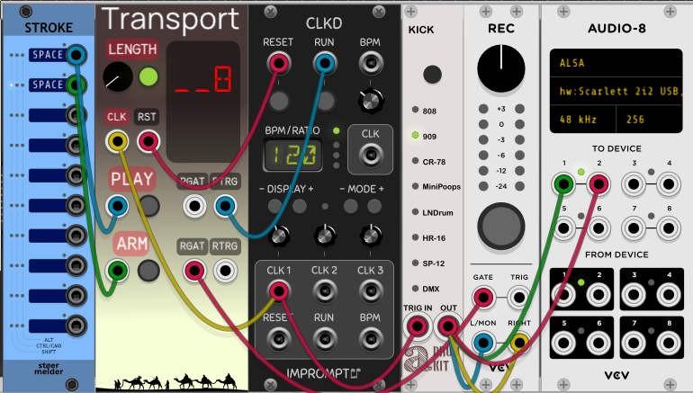

EnigmaCurry's VCV pack
==============================

This is my collection of modules for [VCV Rack](https://vcvrack.com/).

 * [License](#License)
 * [Transport](#Transport)
 * [Latch](#Latch)

## License

This software is licensed under the [GPLv3+
license](https://github.com/EnigmaCurry/EnigmaCurry-vcv-pack/blob/v2/LICENSE)

The panel artwork incorporates the public domain [Camels Caravan
Silhouette](https://openclipart.org/detail/242201/camels-caravan-silhouette)
([CC0-1.0](https://creativecommons.org/publicdomain/zero/1.0/)). If
you publish your own fork, please use different artwork to help
differentiate the models.

## Transport

Transport is a DAW-style play/stop/record control, with clocked
punch-in/punch-out (`Quantize Arming`), allowing to play and/or record
anything for an exact number of clock cycles (bars).

 * Set `LENGTH` to the number of clock cycles (eg. beats, bars) that
   you wish to record. (Or click the button to disable it, and to
   record an unlimited length.)
 * Input a clock signal (`CLK`) to count the number of cycles or bars
   elapsed. (If you want to count bars, usually first divide the
   incoming `CLK` signal by four.)
 * Output a reset signal (`RST`) from Transport back to your clock
   generator. This will reset the clock when playing starts and
   finishes.
 * Tap the `ARM` button, or input a trigger from another source (eg.
   STROKE), to arm recording on next play (or to start recording when
   already playing.)
 * Tap the `PLAY` button, or input a trigger from another source (eg.
   STROKE), to start playing. If recording is armed, recording will
   start too.
 * `PGAT` is output high for the entire time playing. `PTRG` triggers
   a pulse on start and stop.
 * `RGAT` is output high for the entire time recording. `RTRG`
   triggers a pulse on start and stop.
 * Output `PGAT` or `PTRG` to your Clock Generator's `RUN` input.
   (`PGAT` is preferred. For Impromptu Modular's CLOCKED module, set
   `Run CV input is level sensitive` in the right click dialog.)
 * Connect `RGAT` to the recorder GATE input, or `RTRG` to its TRIGGER
   input.
 * In the right click context menu of Transport, set `Quantize Arming`
   if you want the recording to start exactly on the next beat/bar
   x1,2,4,8,16 etc. The arm button will flash while waiting for the
   next quantized beat in order to start or stop recording.
 * In the right click context menu, set `Stop on record length` if you
   wish to stop playback after the recording `LENGTH` counter is
   reached. (When off, the `LENGTH` only affects the recording time.)

Here is an example patch using these third party modules:
[Kick](https://library.vcvrack.com/Autodafe-DrumKit/DrumsKick),
[STROKE](https://library.vcvrack.com/Stoermelder-P1/Stroke),
[CLKD](https://library.vcvrack.com/ImpromptuModular/Clocked-Clkd), and
[Recorder](https://library.vcvrack.com/VCV-Recorder/Recorder):

 * STROKE receives your keyboard shortcuts: `SPACEBAR` and
   `SHIFT+SPACEBAR`. (Right click to teach these keyboard shortcuts to
   STROKE.)
 * Connect the STROKE `SPACEBAR` output to the `PLAY` input of
   Transport.
 * Connect the STROKE `SHIFT+SPACEBAR` output to the `ARM` input of
   Transport.
 * From the right click context menu of CLKD, turn **OFF** `Outputs
   reset high when not running`. This will ensure that the first beat
   corresponds with the first clock cycle.
 * Divide the first clock output of CLKD by 4. (ie. 4 beats per bar).
   Send this signal to the `CLK` input of Transport.
 * Connect the `RST` output from Transport to the `RESET` input of
   CLKD. Transport will send a reset on playback stop.
 * Connect the `PTRG` output from Transport to the `RUN` input of
   CLKD.
 * Trigger the Kick module (or your own) from the clock, and connect
   the output to the Recorder and Audio-8 inputs.
 * Press `SHIFT+SPACEBAR` to arm the recorder. The light will flash
   until playback starts.
 * Press `SPACEBAR` to play/record.
 * Once the specified length is reached, recording stops.
 * At any time press `SPACEBAR` again to stop playing, or
   `SHIFT+SPACEBAR` to stop recording.
 * If you wish recording to be quantized to the clock, enable the
   option in the right click context menu of Transport: `Quantize
   Arming`, set this to a multiple of the clock (1, 2, 4, 8, 16 etc).
 * If you wish playback to stop after the Recrod length is reached,
   use the context menu option `Stop on record length`.

In this scenario, if you had set CLKD BPM to 120, and the Transport
record `LENGTH` to 8, and you recorded for the entire duration, the
recorded .wav file [should be exactly 16s
long](https://toolstud.io/music/bpm.php?bpm=120&bpm_unit=4%2F4) (8
bars * 4 beats/bar * 500ms = 16s). In reality, it records a .wav file
that is 15.99s, so its not exactly frame accurate, maybe this timing
can be improved??

## Latch

Latch contains two (2) polyphonic CV latching gates ('Flip-flops')
with discrete triggers and reset inputs. A trigger on the `TRIG` input
will set `LATCH` output to +10v. A trigger on the `RESET` input will
set `LATCH` output to 0v. The inputs and outputs are duplicated as two
separate sections, an upper and lower. Each input and output accepts
up to 16 channel polyphonic CV, combining both sections offers up to
32 independent flip-flop gates.

Here is an example problem that Latch helpfully solves:

[Impromptu Modular's CLOCKED/CLKD
modules](https://library.vcvrack.com/ImpromptuModular/Clocked-Clkd)
have a `RUN` output that only outputs a trigger when the clock is
started AND/OR when stopped (a toggle). The `RUN` input may be
configured to accept a gate signal by choosing the right click context
menu labeled: `Run input CV is level sensitive`, however the `RUN`
output can only be set as a trigger. If you would rather have a single
persistent gate that is either high when playing or low when stopped,
and you also want to have two discrete play and stop buttons/CV inputs
(not a single toggle button), then you can use Latch to solve this:

You can download this as a [VCV Rack selection
`.vcvs`](https://github.com/EnigmaCurry/EnigmaCurry-vcv-pack/raw/v2/patches/Selections/Latch%20CLKD.vcvs)

 * Connect a trigger button to the first `TRIG` input of Latch.
 * Connect a different trigger button to the `RESET` input of Latch.
   In parallel, connect this same trigger button to the `RESET` input
   of CLOCKED.
 * Connect the `LATCH` output of Latch to the `RUN` input of CLOCKED.
   Right click CLOCKED and select `Run input CV is level sensitive`.
   The same `LATCH` output can be used as a "Play mode gate" elsewhere
   in your patch (attached to the scope for example).
 * Press the first trigger button to start the clock. Additional
   presses will not do anything if the latch is already high.
 * Press the second trigger button to stop/reset the clock. Additional
   presses will not do anything to Latch if the latch is already low
   (but will still reset CLOCKED again because its connected
   directly).

The example above only uses the top section of Latch, and only with a
single monophonic Latch output. You may connect up to 16 polyphonic
trigger+reset inputs and 16 latch outputs per section, for a total of
32 latches if you use both sections. Use the Merge and Split (VCV
Fundamental) devices to use polyphony.

Here is a demonstration that uses 20 latches with discrete TRIG and
RESET inputs from Pulses:

You can download this as a [VCV Rack selection
`.vcvs`](https://github.com/EnigmaCurry/EnigmaCurry-vcv-pack/raw/v2/patches/Selections/Latch%20Demonstration.vcvs)

