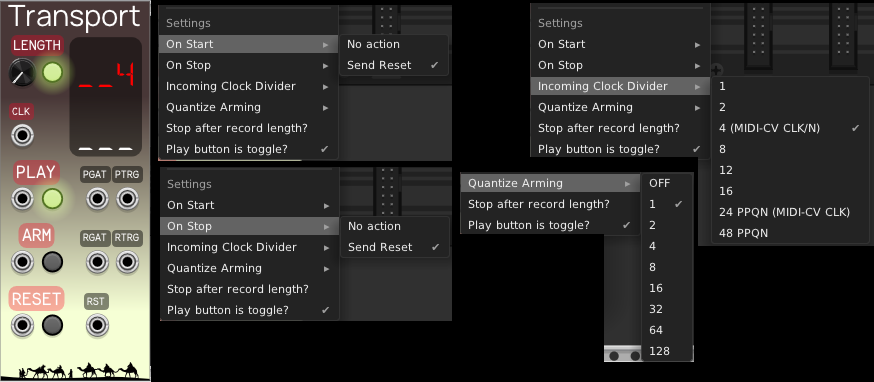

EnigmaCurry's VCV pack
==============================

This is my collection of modules for [VCV Rack](https://vcvrack.com/).

## Transport

Transport is a DAW-style play/stop/record control, with clocked
punch-in/punch-out, allowing to play and record anything for a specific number
of clock cycles (bars).

 * Set Length to the number of cycles (eg. beats, bars) you want to play/record.
   (Or bypassed to play/record forever..)
 * Receive a clock signal (`CLK`) to count the cycles or bars (this should
    usually first be divided by four, in order to count bars).
 * Send a reset signal (`RST`) back to your clock generator.
 * Tap the `ARM` button or send a trigger from another source (eg. STROKE) to arm
   recording on next play (or record immediately if already playing.)
 * Tap the `PLAY` button or send a trigger from another source (eg. STROKE) to
   start playing and/or recording.
 * `PGAT` is output high when playing. `PTRG` triggers a pulse on start and stop.
 * `RGAT` is output high when recording. `RTRG` triggers a pulse on start and stop.
 * Connect `PTRG` to Clock source `RUN` input.
 * Connect `RGAT` to Recorder GATE input, or `RTRG` to TRIGGER input.
 * In the right click context menu, set quantizing for the arm so that recording
   starts exactly on the next beat/bar x1,2,4,8,16 etc. The arm button will
   flash while waiting for the next quantized beat.

Here is an example patch using these third party modules:
[Kick](https://library.vcvrack.com/Autodafe-DrumKit/DrumsKick),
[STROKE](https://library.vcvrack.com/Stoermelder-P1/Stroke),
[CLKD](https://library.vcvrack.com/ImpromptuModular/Clocked-Clkd), and
[Recorder](https://library.vcvrack.com/VCV-Recorder/Recorder):

 * STROKE receives your keyboard shortcuts: `SPACEBAR` and `SHIFT-SPACEBAR`.
 * Connect the STROKE `SPACEBAR` output to the `PLAY` input of Transport.
 * Connect the STROKE `SHIFT-SPACEBAR` output to the `ARM` input of Transport.
 * From the right click context menu of CLKD, turn **OFF** `Outputs reset high
   when not running`. This will ensure that the first beat corresponds with the
   first clock cycle.
 * Divide the first clock output of CLKD by 4. (ie. 4 beats per bar). Send this
   signal to the `CLK` input of Transport.
 * Connect the `PTRG` output from Transport to the `RUN` input of CLKD.
 * Connect the `RST` output from Transport to the `RESET` input of CLKD.
 * Trigger Kick from the clock, and connect the output to the Recorder and
   Audio-8 inputs.
 * Press shift-spacebar to arm the recorder.
 * Press spacebar to play/record.
 * Once the specified length is reached, everything resets. You can also press
   spacebar again to reset early.

In this scenario, if you had set CLKD BPM to 120, and Transport Length to 8, and
you recorded for the entire duration, the recorded .wav file [should be exactly
16s long](https://toolstud.io/music/bpm.php?bpm=120&bpm_unit=4%2F4) (8 bars * 4
beats/bar * 500ms = 16s).
