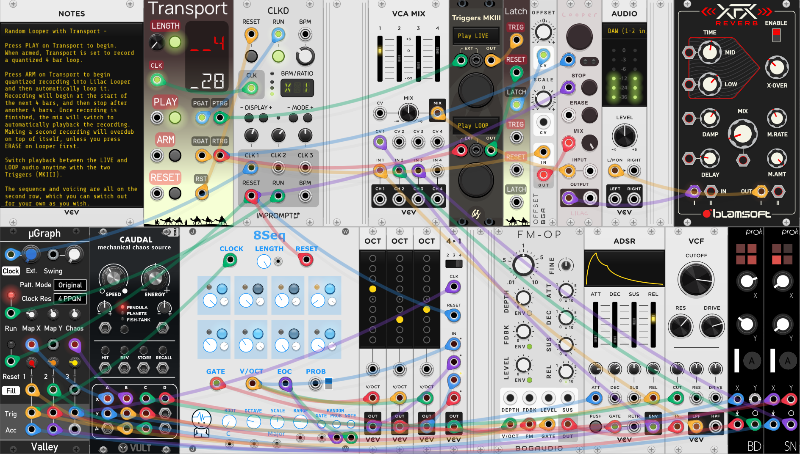

EnigmaCurry's VCV pack
==============================

This is my collection of modules for [VCV Rack](https://vcvrack.com/).

 * [License](#License)
 * [Transport](#Transport)
 * [Latch](#Latch)

## License

This software is fully licensed under the [GNU General Public License
v3.0+](https://github.com/EnigmaCurry/EnigmaCurry-vcv-pack/blob/v2/LICENSE),
in the spirit of freely sharing with the VCV Rack and Cardinal
community. At your discretion, you may alternatively use this software
under the terms of the [MIT
license](https://github.com/EnigmaCurry/EnigmaCurry-vcv-pack/blob/v2/LICENSE.MIT).

The panel artwork incorporates the public domain [Camels Caravan
Silhouette](https://openclipart.org/detail/242201/camels-caravan-silhouette)
([CC0-1.0](https://creativecommons.org/publicdomain/zero/1.0/)). If
you publish your own fork, please use different artwork to help
differentiate the models.

Typeface fonts included are licensed under the SIL OPEN FONT LICENSE Version 1.1:

  * [Fantasque](https://github.com/EnigmaCurry/EnigmaCurry-vcv-pack/blob/v2/res/fonts/Fantasque/LICENSE.txt) Copyright (c) 2013-2017, Jany Belluz (jany.belluz@hotmail.fr)
  * [DSEG](https://github.com/EnigmaCurry/EnigmaCurry-vcv-pack/blob/v2/res/fonts/dseg/DSEG-LICENSE.txt) Copyright (c) 2017, keshikan (http://www.keshikan.net)
  * [Manrope](https://github.com/EnigmaCurry/EnigmaCurry-vcv-pack/blob/v2/res/fonts/manrope/LICENSE.txt) Copyright [https://manropefont.com/](https://manropefont.com/)

## Transport

Transport is a DAW-style play/stop/record control, with clocked
punch-in/punch-out (`Quantize Arming`), allowing to play and/or record
anything for an exact number of clock cycles (bars).

 * Set `LENGTH` to the number of clock cycles (eg. beats, bars) that
   you wish to record. (Or click the button to disable it, and to
   record an unlimited length.)
 * Input a clock signal (`CLK`) to count the number of cycles or bars
   elapsed. (If you want to count bars, usually first divide the
   incoming `CLK` signal by four. If using Impromptu CLOCKED, turn OFF
   `Outputs high on reset when not running`.)
 * Output a reset signal (`RST`) from Transport back to your clock
   generator. This will reset the clock when playing starts and
   finishes.
 * Tap the `ARM` button, or input a trigger from another source (eg.
   STROKE), to arm recording on next play (or to start recording when
   already playing.)
 * Tap the `PLAY` button, or input a trigger from another source (eg.
   STROKE), to start playing. If recording is armed, recording will
   start too.
 * `PGAT` is output high for the entire time playing. `PTRG` triggers
   a pulse on start and stop.
 * `RGAT` is output high for the entire time recording. `RTRG`
   triggers a pulse on start and stop.
 * Output `PGAT` or `PTRG` to your Clock Generator's `RUN` input.
   (`PGAT` is preferred. For Impromptu Modular's CLOCKED module, set
   `Run CV input is level sensitive` in the right click dialog.)
 * Connect `RGAT` to the recorder GATE input, or `RTRG` to its TRIGGER
   input.
 * In the right click context menu of Transport, set `Quantize Arming`
   if you want the recording to start exactly on the next beat/bar
   x1,2,4,8,16 etc. The arm button will flash while waiting for the
   next quantized beat in order to start or stop recording.
 * In the right click context menu, set `Stop on record length` if you
   wish to stop playback after the recording `LENGTH` counter is
   reached. (When off, the `LENGTH` only affects the recording time.)

Here is an example patch that acts as a Live Looper platform:

You can download this as a [VCV Rack selection
`.vcvs`](https://github.com/EnigmaCurry/EnigmaCurry-vcv-pack/raw/v2/patches/Selections/Transport%20Looper.vcvs)

## Latch

Latch contains two (2) polyphonic CV latching gates ('Flip-flops')
with discrete triggers and reset inputs. A trigger on the `TRIG` input
will set `LATCH` output to +10v. A trigger on the `RESET` input will
set `LATCH` output to 0v. The inputs and outputs are duplicated as two
separate sections, an upper and lower. Each input and output accepts
up to 16 channel polyphonic CV, combining both sections offers up to
32 independent flip-flop gates.

Here is a simple example, where Latch transforms any set of triggers
into a persistent ON/OFF gate:

Here is another example problem that Latch helpfully solves:

[Impromptu Modular's CLOCKED/CLKD
modules](https://library.vcvrack.com/ImpromptuModular/Clocked-Clkd)
have a `RUN` output that only outputs a trigger when the clock is
started AND/OR when stopped (a toggle). The `RUN` input may be
configured to accept a gate signal by choosing the right click context
menu labeled: `Run input CV is level sensitive`, however the `RUN`
output can only be set as a trigger. If you would rather have a single
persistent gate that is either high when playing or low when stopped,
and you also want to have two discrete play and stop buttons/CV inputs
(not a single toggle button), then you can use Latch to solve this:

You can download this as a [VCV Rack selection
`.vcvs`](https://github.com/EnigmaCurry/EnigmaCurry-vcv-pack/raw/v2/patches/Selections/Latch%20CLKD.vcvs)

 * Connect a trigger button to the first `TRIG` input of Latch.
 * Connect a different trigger button to the `RESET` input of Latch.
   In parallel, connect this same trigger button to the `RESET` input
   of CLOCKED.
 * Connect the `LATCH` output of Latch to the `RUN` input of CLOCKED.
   Right click CLOCKED and select `Run input CV is level sensitive`
   and turn OFF `Outputs high on reset when not running.` The same
   `LATCH` output can be used as a "Play mode gate" elsewhere in your
   patch (attached to the scope for example).
 * Press the first trigger button to start the clock. Additional
   presses will not do anything if the latch is already high.
 * Press the second trigger button to stop/reset the clock. Additional
   presses will not do anything to Latch if the latch is already low
   (but will still reset CLOCKED again because its connected
   directly).

The example above only uses the top section of Latch, and only with a
single monophonic Latch output. You may connect up to 16 polyphonic
trigger+reset inputs and 16 latch outputs per section, for a total of
32 latches if you use both sections. Use the Merge and Split (VCV
Fundamental) devices to use polyphony.

Here is a demonstration that uses 20 latches with discrete TRIG and
RESET inputs from Pulses:

You can download this as a [VCV Rack selection
`.vcvs`](https://github.com/EnigmaCurry/EnigmaCurry-vcv-pack/raw/v2/patches/Selections/Latch%20Demonstration.vcvs)

